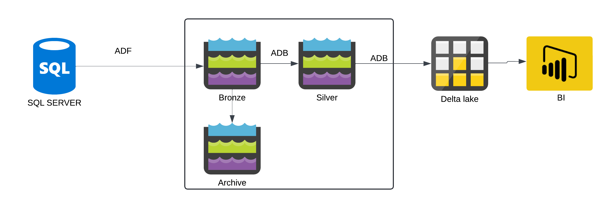

# On_Premise(SQL SERVER)_to_Delta_Lake

## Agenda
I have data in SQL Server (AdventureWorks), and I want to migrate all this data into a Delta Lake, where the BI team can connect and create reports.

### Technologies 
`SQL`
`Python`
`Azure Databricks`
`Azure Data Factory`
`Azure Data Lake`
`Logic App`

### Project Architecture

### ETL
Extracted data from SQL Server using **Azure Data Factory** and loaded it into the **Azure Data Lake** Bronze layer. The data was then moved into an archive layer for future reference. Null values and duplicate records were removed from the Bronze layer using **Azure Databricks**, and the cleaned data was placed into the Silver layer. In the Silver layer, business logic was applied, such as dropping unnecessary data and deriving business columns. Finally, Delta tables were created in the Hive Metastore for further analysis.Additionally, **Azure Logic Apps** was used to send email notifications when a pipeline failed.

### Azure Data Factory
#### Usage
Ingesting all data from SQL Server into Azure Data Lake.

#### Components
- Activities: Define the operations to be performed (e.g., copy, transformation).
- Integration Runtimes: Enable data movement and transformation.
- Linked Services: Connect external services like SQL Server, Data Lake.
- Datasets: Represent the data structure within the pipelines.
### Azure Databricks
#### Usage
Cleaning and deriving business-required columns.

#### Components
- Cluster: Provides the compute resources for running data processing tasks.
- Workspace: Organizes notebooks, libraries, and data objects.
- Hive_catalog: Manages metadata for the Delta tables.
- Delta table: Stores processed data in an optimized format for querying.
- Notebooks: Interactive environments for writing code, running queries, and building models.
- Magic commands: Shortcuts to run specific commands, such as %sql, %fs, etc., for different functionalities within notebooks.
### Azure Data Lake
#### Usage
Azure Data Lake is used to store data based on different use cases:
- Hot Tier: For data that needs to be processed frequently.
- Cold Tier: For infrequent access data.
- Archive Tier: For data that doesn't need to be processed for an extended period.
#### Components
- Containers: Organize and store data files within the Data Lake.
- Tiers: Define storage levels (Hot, Cool, Archive) based on access frequency and cost considerations.
ACLs (Access Control Lists): Manage permissions and access control for data stored in the Data Lake.
### Azure Logic Apps
#### Usage
Azure Logic Apps is used to send email notifications for pipeline failures.

#### Components
- HTTP URL: Enables the Logic App to connect with external services or trigger workflows via webhooks.
- Email Configuration: Set up settings for sending emails, including recipient addresses, subject lines, and message bodies.

